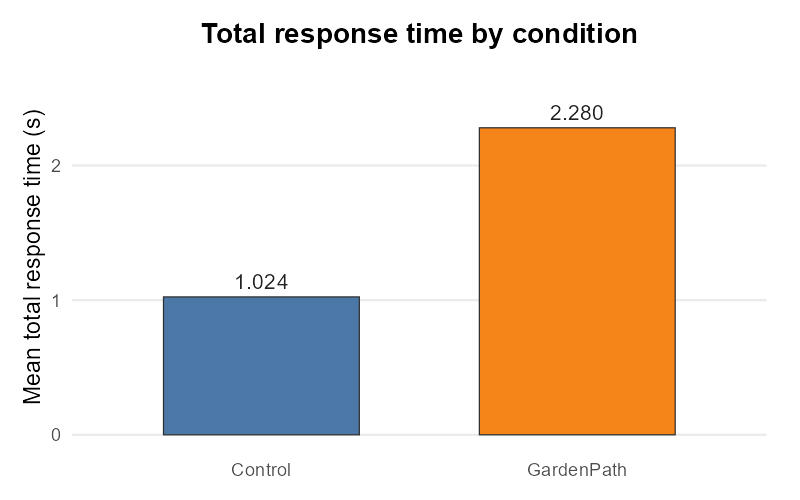
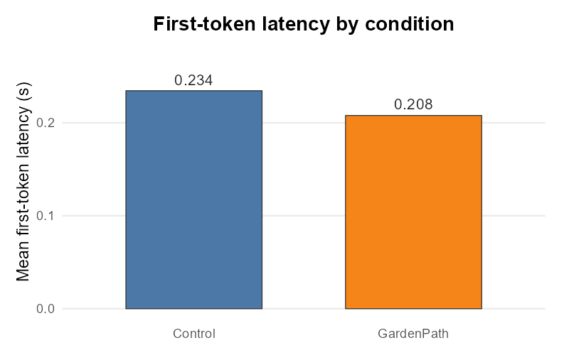
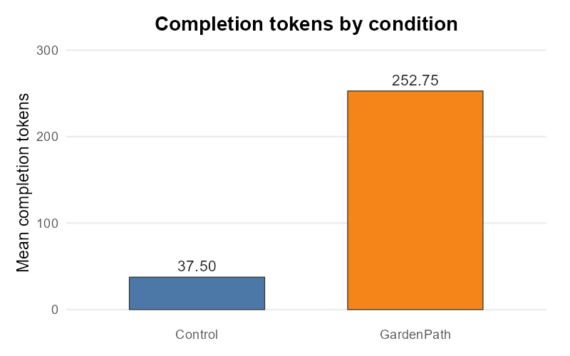
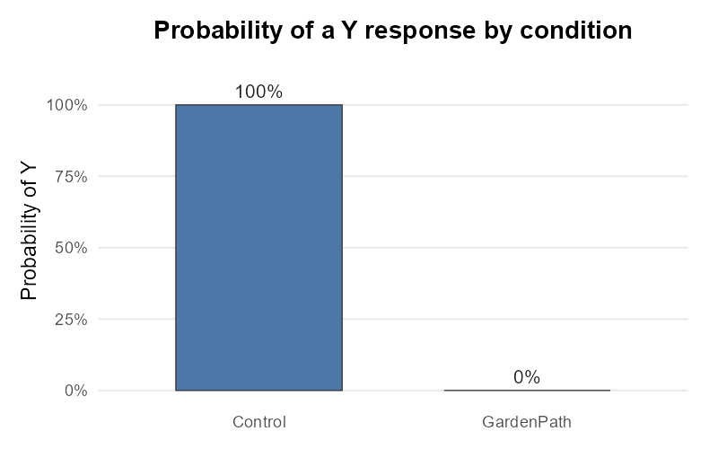

# PsyLingLLM

PsyLingLLM is an R package for controlled psychological, psycholinguistic,
cognitive, and educational experiments with large language models (LLMs). It
helps researchers present the same materials across models and providers while
collecting responses, reasoning fields, timing, token usage, request IDs, trial
status, and logs in a consistent data structure.

Version 0.4 introduces a Registry v2 runtime architecture. Model resolution,
request construction, HTTP transport, streaming, response parsing, and result
normalization are now separate responsibilities. Existing experiment functions
and Registry v1 user files remain supported.

## Background

LLMs are increasingly used as experimental participants, stimulus generators,
and computational comparison systems in psycholinguistics, psychology,
cognitive science, and education. A controlled study needs more than a single
prompt: researchers must preserve materials, instructions, model settings,
trial order, conversation history, timing, responses, reasoning fields, usage,
errors, and provider metadata.

PsyLingLLM provides one experiment layer for those tasks. The same material
table can be presented to different models while the Registry translates the
provider-specific API contract. This separation lets experiment scripts remain
stable when a model moves to another endpoint or when a provider adds a new
protocol version.

PsyLingLLM supports:

- single-trial and repeated-trial experiments;
- factorial designs generated from controlled carrier materials;
- multi-turn conversation and memory experiments;
- adaptive experiments driven by a user feedback function;
- comparisons across models and providers;
- CSV and Excel material workflows with preserved condition columns;
- streaming latency, response time, token, reasoning, status, and request-ID
  collection;
- Registry-based official, proxy, cloud-deployment, and local-runtime setups.

The package standardizes execution and measurement. It does not make hosted
models deterministic, and it does not turn a small demonstration into evidence
of human-like cognition. Reproducible research still requires adequate
materials, repetitions, controls, model-version records, and statistical
analysis.

## Design principle: user registration comes first

PsyLingLLM is designed around user-managed model registration.

- The bundled system registry supplies basic presets and protocol examples.
- The user registry is the main extension point for new models, changed APIs,
  proxy services, and local deployments.
- A user entry with the same model key takes precedence over the bundled entry.
- PsyLingLLM does not automatically rewrite or migrate user registry files.
- If a bundled preset becomes outdated, users can replace it locally without
  waiting for a package release.

The effective precedence is:

```text
Runtime arguments > User registry > System registry > Package defaults
```

A model appearing in the bundled registry does not guarantee that the upstream
model is available to every account. The system registry is a starting point;
the user registry remains authoritative for an individual experiment.

## Installation

Install the development version from GitHub:

```r
install.packages("remotes")
remotes::install_github("HanMingPsy/PsyLingLLM-R")

library(PsyLingLLM)
packageVersion("PsyLingLLM")
```

PsyLingLLM requires R 4.0 or later.

## Contents

### Overview and experiment system

1. [Background](#background)
2. [Authentication and quick start](#authentication-and-quick-start)
3. [Experimental workflow](#experimental-workflow)
4. [Single-trial and repeated experiments](#single-trial-and-repeated-experiments)
5. [Factorial designs](#factorial-designs)
6. [Conversation experiments](#conversation-experiments)
7. [Adaptive feedback](#adaptive-feedback)
8. [Multi-model experiments](#multi-model-experiments)
9. [Input, output, and file management](#input-output-and-file-management)
10. [Function guide](#function-guide)

### Registry topics

11. [Registry resolution](#registry-resolution)
12. [Models, providers, interfaces, and capabilities](#models-providers-interfaces-and-capabilities)
13. [Provider-native parameters](#provider-native-parameters)
14. [Registering a model](#registering-a-model)
15. [Validating a registration](#validating-a-registration)
16. [Bundled support levels](#bundled-support-levels)
17. [Runtime architecture](#runtime-architecture)
18. [Errors, privacy, and reproducibility](#errors-privacy-and-reproducibility)
19. [Research design and interpretation](#research-design-and-interpretation)
20. [Troubleshooting](#troubleshooting)
21. [Testing and CRAN](#testing-and-cran)
22. [Contributing and support](#contributing-and-support)
23. [License](#license)

## Experiment system

### Authentication and quick start

An experiment needs three pieces of provider information:

1. an API key or another authentication credential;
2. a Registry model key, which resolves to the provider-facing model ID;
3. an endpoint, either supplied by the Registry or explicitly overridden with
   `api_url` for a proxy, workspace, cloud deployment, or local server.

For a bundled official preset, users normally provide only the Registry model
key and API key. Model IDs and account availability remain provider-specific;
check the upstream account catalog if a preset returns a model-not-found error.

Do not put API keys in an experiment table, Registry YAML file, README, or
version-controlled script. For non-interactive work, environment variables are
a simple option. Add values to a user-level `.Renviron` file and restart R:

```text
DEEPSEEK_API_KEY=your_key_here
OPENAI_API_KEY=your_key_here
```

For desktop use, the optional `keyring` package can read credentials from the
operating system credential store:

```r
# Environment variable
deepseek_key <- Sys.getenv("DEEPSEEK_API_KEY")

# Optional alternative; PsyLingLLM does not manage the keyring itself
# deepseek_key <- keyring::key_get("PsyLingLLM", "deepseek")
```

Load a reproducible material file bundled with the package and run a small
experiment:

```r
library(PsyLingLLM)

garden_path_file <- system.file(
  "extdata",
  "garden_path_sentences.csv",
  package = "PsyLingLLM"
)

garden_path <- readr::read_csv(
  garden_path_file,
  show_col_types = FALSE
)

yn_system_prompt <- paste(
  "You are a participant in a psychology experiment.",
  "Your task is to answer the following questions with ONLY a single character: Y for Yes or N for No.",
  "Do not provide any other text, explanation, or punctuation.",
  sep = "\n"
)

result <- trial_experiment(
  model_key = "deepseek-flash",
  api_key = deepseek_key,
  data = garden_path[1:2, ],
  system_content = yn_system_prompt,
  optionals = list(
    max_tokens = 64L,
    thinking = list(type = "disabled")
  ),
  stream = FALSE,
  random = FALSE,
  delay = 0
)

result[c(
  "Item", "Condition", "Response", "TrialStatus",
  "PromptTokens", "CompletionTokens"
)]
```

The bundled DeepSeek preset provides its official endpoint. Supply `api_url`
when a workspace, proxy, local server, or private deployment uses a different
request URL.

### Experimental workflow

A typical PsyLingLLM study follows this sequence:

```text
Material table
  -> experiment design and trial ordering
  -> Registry model/interface resolution
  -> provider-native request construction
  -> HTTP or streaming transport
  -> response and reasoning parsing
  -> standardized experiment rows and log files
  -> descriptive or inferential analysis
```

Keep the experimental manipulation in the material table or factorial design,
and keep provider details in the Registry or runtime arguments. This makes it
possible to rerun the same design with another provider without rewriting the
experiment logic.

Before a large or costly run:

1. inspect the material rows and condition counts;
2. resolve the selected Registry entry;
3. run one short non-streaming request;
4. run one short streaming request when latency is measured;
5. run one complete trial through the experiment function;
6. inspect response format, reasoning, usage, status, and saved paths;
7. only then start the full experiment.

### Single-trial and repeated experiments

`trial_experiment()` executes each row in a material table. `Material` is the
required content column. An optional row-level `TrialPrompt` takes precedence
over the global `trial_prompt` argument.

#### Multilingual sentence-completion example

The first experiment from the earlier PsyLingLLM README is retained as a
multilingual UTF-8 demonstration. The materials are now stored in a package
file instead of being duplicated inside the analysis script:

| Item | Language | Material |
|---:|---|---|
| 1 | English | The cat sat on the ____. |
| 2 | Chinese (Simplified) | 这只猫咪坐在____上。 |
| 3 | French | Le chat était assis sur le ____. |
| 4 | Spanish | El gato estaba sentado en el ____. |
| 5 | German | Die Katze saß auf dem ____. |
| 6 | Italian | Il gatto era seduto sul ____. |
| 7 | Japanese | ネコが____の上に座っていました。 |
| 8 | Korean | 고양이가 ____ 위에 앉아 있었습니다. |
| 9 | Portuguese | O gato estava sentado no ____. |
| 10 | Swedish | Katten satt på ____. |
| 11 | Russian | Кот сидел на ____. |

```r
multilingual_file <- system.file(
  "extdata",
  "multilingual_completion.csv",
  package = "PsyLingLLM"
)

multilingual_data <- readr::read_csv(
  multilingual_file,
  show_col_types = FALSE
)

multilingual_result <- trial_experiment(
  model_key = "deepseek-flash",
  api_key = Sys.getenv("DEEPSEEK_API_KEY"),
  data = multilingual_data,
  system_content = paste(
    "You are participating in a multilingual sentence-completion experiment.",
    "Follow the requested output format exactly."
  ),
  optionals = list(
    max_tokens = 128L,
    thinking = list(type = "disabled")
  ),
  stream = FALSE,
  repeats = 1,
  random = FALSE,
  delay = 0
)

multilingual_result[c(
  "Item", "ConditionLanguage", "Material",
  "Response", "TrialStatus"
)]
```

For an initial endpoint check, use `data = multilingual_data[1:2, ]` before
running all languages. The example verifies that multilingual text survives the
material, request, response, and result-file path. It is not by itself a fair
cross-language benchmark: comparable scoring requires language-specific target
definitions, tokenization records, sufficient items, and human-validated
coding rules.

#### Garden Path judgment task

The bundled demonstration presents four Garden Path sentences and two clear
controls. It illustrates how to combine categorical judgments with streaming
latency and token measurements. The small material set is a software example,
not a validated experimental norm.

| Item | Condition | Material | Target |
|---:|---|---|---|
| 1 | GardenPath | The old man the boats. | No |
| 2 | GardenPath | The horse raced past the barn fell. | No |
| 3 | GardenPath | Fat people eat accumulates. | No |
| 4 | GardenPath | The man whistling tunes pianos. | No |
| 5 | Control | Birds are singing in the garden. | Yes |
| 6 | Control | The children played football after school. | Yes |

The system message constrains the observable answer to one character. When the
selected interface exposes a separate reasoning channel, `Think` can still be
recorded independently from `Response`.

```r
garden_path_result <- trial_experiment(
  model_key = "deepseek-flash",
  api_key = Sys.getenv("DEEPSEEK_API_KEY"),
  data = garden_path,
  system_content = yn_system_prompt,
  optionals = list(
    max_tokens = 1024L,
    thinking = list(type = "enabled"),
    reasoning_effort = "high"
  ),
  stream = TRUE,
  repeats = 1,
  random = FALSE,
  delay = 0
)

garden_path_result$Response <- toupper(
  trimws(garden_path_result$Response)
)

stopifnot(
  all(garden_path_result$TrialStatus == "SUCCESS"),
  all(garden_path_result$Response %in% c("Y", "N"))
)
```

`repeats` duplicates the complete material table before execution. Set a random
seed when randomized trial order must be reproducible:

```r
set.seed(2026)
```

The provider-native `thinking` object enables DeepSeek thinking mode;
`reasoning_effort` controls its effort. These fields are sent without renaming.
They are protocol-specific, so consult the provider documentation before using
them with another interface.

Summarize response latency, token use, and the probability of a `Y` judgment:

```r
library(dplyr)

summary_result <- garden_path_result %>%
  group_by(Condition) %>%
  summarise(
    n = n(),
    mean_FTL = mean(FirstTokenLatency, na.rm = TRUE),
    mean_RT = mean(TotalResponseTime, na.rm = TRUE),
    mean_tokens = mean(CompletionTokens, na.rm = TRUE),
    Y_prob = mean(Response == "Y", na.rm = TRUE),
    .groups = "drop"
  )

print(summary_result)
```

A live run with `deepseek-flash` on September 20, 2026 produced the following
result. Timing and model output can vary across runs and provider revisions.

| Condition | n | mean_FTL | mean_RT | mean_tokens | Y_prob |
|---|---:|---:|---:|---:|---:|
| Control | 2 | 0.234 | 1.024 | 37.50 | 1.00 |
| GardenPath | 4 | 0.208 | 2.280 | 252.75 | 0.00 |

All six trials completed successfully, returned exactly one `Y` or `N`, and
included a non-empty reasoning field, token usage, and request ID. No trial
reached the configured 1,024-token completion limit.

The optional `ggplot2` package can visualize the four descriptive measures:

```r
library(ggplot2)

plot_bar <- function(data, y_var, y_label, title) {
  ggplot(data, aes(x = Condition, y = .data[[y_var]], fill = Condition)) +
    geom_col(width = 0.6, color = "black") +
    labs(title = title, x = "Condition", y = y_label) +
    theme_minimal(base_size = 14) +
    theme(
      legend.position = "none",
      plot.title = element_text(hjust = 0.5, face = "bold")
    )
}

plot_bar(
  summary_result,
  "mean_RT",
  "Mean total response time (s)",
  "Mean total response time by condition"
)

plot_bar(
  summary_result,
  "mean_FTL",
  "Mean first-token latency (s)",
  "Mean first-token latency by condition"
)

plot_bar(
  summary_result,
  "mean_tokens",
  "Mean completion tokens",
  "Mean completion tokens by condition"
)

ggplot(summary_result, aes(x = Condition, y = Y_prob, group = 1)) +
  geom_line(color = "#2c7fb8", linewidth = 1.2) +
  geom_point(size = 3, color = "#2c7fb8") +
  scale_y_continuous(
    limits = c(0, 1),
    labels = function(x) paste0(round(100 * x), "%")
  ) +
  labs(
    title = "Probability of responding Y by condition",
    x = "Condition",
    y = "Probability of Y"
  ) +
  theme_minimal(base_size = 14) +
  theme(plot.title = element_text(hjust = 0.5, face = "bold"))
```

The following figures were generated from the live result shown above:









In this run, Garden Path items required more total time and more completion
tokens than Control items, while first-token latency was similar and slightly
lower for Garden Path items. The model rejected every Garden Path item and
accepted both Control items. These values demonstrate the experimental and
measurement workflow; six trials are not enough to establish a psycholinguistic
effect or a human-like processing pattern. A confirmatory study should use more
items, repetitions, models, and an appropriate statistical analysis.

Related psycholinguistic work includes Ferreira and Henderson (1991) on
recovery from garden-path misanalysis and Christianson et al. (2001) on the
persistence of thematic interpretations. These references motivate the
paradigm; they do not validate the six-item demonstration or the model result.

#### Progress, results, and log files

During execution, the console displays the current trial, total number of
trials, completion percentage, estimated time remaining, and model key. A
typical progress line has this form:

```text
[====================--------------------] 50% Trial 3/6 - ETA: 00:05 - deepseek-flash
```

When `output_path = NULL`, experiment functions create timestamped results and
logs under `~/.psylingllm/results`. For example:

```text
deepseek-flash_20260920_132306.csv
deepseek-flash_20260920_132306.log
```

`output_path` can be a full CSV/XLSX filename or a directory. A directory gets
an automatically generated filename. `overwrite = FALSE` protects an existing
explicit output file. Tests and package examples should instead use
`tempdir()` so they do not write persistent user files.

#### `trial_experiment()` arguments

| Argument | Purpose and behavior |
|---|---|
| `model_key` | Registry key for the model or deployment |
| `generation_interface` | Friendly interface label or exact versioned interface ID; defaults to `"chat"` |
| `api_key` | Runtime credential; never store it in materials or Registry YAML |
| `api_url` | Optional complete endpoint override for a proxy, workspace, deployment, or local server |
| `data` | Data frame or tibble containing `Material`; use a list-generation helper to load CSV/XLSX first |
| `trial_prompt` | Global task instruction; a non-empty row-level `TrialPrompt` takes precedence |
| `system_content` | Global system instruction, subject to the selected protocol's role support |
| `assistant_content` | Static few-shot or seed assistant messages placed before trial history |
| `optionals` | Named list of provider-native request parameters; names and nested values are sent without cross-provider translation |
| `role_mapping` | Optional override for Registry role labels |
| `stream` | `FALSE` by default for `trial_experiment()`; `TRUE` enables streaming when the interface supports it |
| `timeout` | Per-request limit in seconds; default 120 |
| `repeats` | Number of copies of the complete material table |
| `random` | Whether to shuffle the expanded trial order |
| `delay` | Pause in seconds after each request |
| `output_path` | Result filename or directory; `NULL` uses the timestamped user results directory |
| `overwrite` | Whether an existing explicit result file may be replaced |
| `return_raw` | Requests raw runtime diagnostics from `llm_caller()`; experiment tables keep the standardized row schema, so use a direct caller request when the raw object itself must be inspected |

`trial_experiment()` and `factorial_trial_experiment()` default `optionals` to
`NULL`, so they do not inject Registry optional defaults. The conversation
functions preserve the full three-state contract: omitting `optionals` uses
Registry defaults, explicit `NULL` suppresses them, and a named list sends only
the supplied values. Direct `llm_caller()` behavior is described later.

#### Sentence-completion task

The sentence-completion materials are also available as CSV and XLSX files:

```r
completion_file <- system.file(
  "extdata",
  "Sentence_Completion.csv",
  package = "PsyLingLLM"
)

completion_data <- readr::read_csv(
  completion_file,
  show_col_types = FALSE
)

completion_result <- trial_experiment(
  model_key = "deepseek-flash",
  api_key = Sys.getenv("DEEPSEEK_API_KEY"),
  data = completion_data,
  trial_prompt = "Complete the blank with one word only.",
  optionals = list(max_tokens = 32L),
  stream = FALSE,
  random = FALSE,
  delay = 0
)
```

The completion file contains one row per stimulus. Repetition and randomization
are added by the experiment function, while all source columns remain attached
to the resulting rows. For a controlled completion study, define in advance
whether scoring uses the full returned sentence, the completed word, a semantic
category, or human coding; do not infer the scoring rule after observing model
responses.

#### One direct request

Use `llm_caller()` when a trial table is unnecessary:

```r
response <- llm_caller(
  model_key = "gpt-5.6-luna",
  api_key = Sys.getenv("OPENAI_API_KEY"),
  material = "Reply with the word OK only.",
  optionals = list(
    max_output_tokens = 64L,
    reasoning = list(effort = "low")
  ),
  stream = FALSE
)

response$answer
response$thinking
response$usage
```

The normalized caller result contains:

| Field | Meaning |
|---|---|
| `status` | Public runtime status; compatibility failures use `599` |
| `answer` | Final semantic answer text |
| `thinking` | Separate reasoning content when declared and returned |
| `usage` | Prompt/completion usage and request ID when supplied by the provider |
| `streaming` | Effective transport mode |
| `first_token_latency` | Time to the first streamed content token when available |
| `error` | Structured provider or transport evidence on failure |
| `raw` | Redacted request/response diagnostics only when `return_raw = TRUE` |

Use `llm_caller()` for endpoint smoke tests, adapter diagnostics, and one-off
requests. Use an experiment function when rows, repetitions, randomization,
logs, and standardized result files are part of the research workflow.

### Factorial designs

`factorial_trial_experiment()` expands carrier materials across all combinations
of user-defined factors, realizes each condition with a fill function, and then
runs the resulting trial table through the same standardized runtime. This is
useful when the experimental manipulation should vary while the surrounding
lexical material stays controlled.

The bundled factorial demonstration is a 2 x 2 agreement-attraction design:

- `AttractorNumber`: singular or plural.
- `Agreement`: match or mismatch with the singular head noun.

The carrier sentences use `noun(s)` and `{VERB}` placeholders. The custom
`fill_method` realizes each condition before the API call.

With four carrier items, two attractor-number levels, two agreement levels,
one repetition, and no critical-word table, the design contains
`4 x 2 x 2 x 1 = 16` trials.

```r
factorial_file <- system.file(
  "extdata",
  "factorial_design.csv",
  package = "PsyLingLLM"
)

factorial_data <- readr::read_csv(
  factorial_file,
  show_col_types = FALSE
)

fill_agreement <- function(condition, material, word) {
  stimulus <- sub(
    "\\(s\\)",
    if (condition$AttractorNumber == "plural") "s" else "",
    material
  )
  verb <- if (condition$Agreement == "match") "is" else "are"
  sub("{VERB}", verb, stimulus, fixed = TRUE)
}

factorial_preview <- generate_llm_factorial_experiment_list(
  data = factorial_data,
  factors = list(
    AttractorNumber = c("singular", "plural"),
    Agreement = c("match", "mismatch")
  ),
  repeats = 1,
  random = FALSE
)

stopifnot(nrow(factorial_preview) == 16L)

factorial_result <- factorial_trial_experiment(
  model_key = "deepseek-flash",
  api_key = Sys.getenv("DEEPSEEK_API_KEY"),
  data = factorial_data,
  factors = list(
    AttractorNumber = c("singular", "plural"),
    Agreement = c("match", "mismatch")
  ),
  fill_method = fill_agreement,
  optionals = list(max_tokens = 32L),
  stream = FALSE,
  random = TRUE,
  delay = 0
)

factorial_result[c(
  "Item", "AttractorNumber", "Agreement", "Stimulus",
  "ConditionLabel", "Response"
)]
```

Before making any API request, inspect the expanded design with
`generate_llm_factorial_experiment_list()` if required. When `fill_method` is
omitted, the built-in filler supports `{CW}`, `[CW]`, `__CW__`, and `____`
critical-word placeholders.

Factorial output retains the factor columns and adds `Stimulus` and
`ConditionLabel`, so the result can be grouped without reconstructing the
experimental design:

```r
factorial_summary <- factorial_result %>%
  group_by(AttractorNumber, Agreement) %>%
  summarise(
    mean_rating = mean(as.numeric(Response), na.rm = TRUE),
    mean_RT = mean(TotalResponseTime, na.rm = TRUE),
    .groups = "drop"
  )
```

Before interpreting the means, inspect response-format violations and missing
trials. For confirmatory work, analyze item and model variability rather than
treating the expanded rows as independent observations without qualification.

### Conversation experiments

`conversation_experiment()` groups rows by `ConversationId`, sorts them by
`Turn`, and carries structured user/assistant history forward. The bundled
example measures free recall and source memory after an encoding turn.

Unlike independent trials, later turns can depend on earlier model responses.
This supports research on memory, priming, adaptation, consistency, and
sequential dependence. It also changes the unit of randomization: preserve turn
order inside each conversation, and treat a complete `ConversationId` sequence
as the coherent experimental unit.

The bundled data contain two three-turn conversations:

| ConversationId | Turn | Condition | Task |
|---|---:|---|---|
| `memory-1` | 1 | `encoding` | Remember *lantern* and reply `READY` |
| `memory-1` | 2 | `free_recall` | Recall the target word |
| `memory-1` | 3 | `source_memory` | Judge whether it was described as living |
| `memory-2` | 1 | `encoding` | Remember *meadow* and reply `READY` |
| `memory-2` | 2 | `free_recall` | Recall the target word |
| `memory-2` | 3 | `source_memory` | Judge whether it was described as a place |

```r
conversation_file <- system.file(
  "extdata",
  "conversation_experiment.csv",
  package = "PsyLingLLM"
)

conversation_data <- readr::read_csv(
  conversation_file,
  show_col_types = FALSE
)

conversation_result <- conversation_experiment(
  model_key = "deepseek-flash",
  api_key = Sys.getenv("DEEPSEEK_API_KEY"),
  data = conversation_data,
  system_content = paste(
    "You are participating in a memory experiment.",
    "Follow the requested response format exactly."
  ),
  optionals = list(max_tokens = 64L),
  history_mode = "all",
  max_history_turns = 2,
  stream = FALSE,
  random = FALSE,
  delay = 0
)
```

History options:

- `history_mode = "all"` retains earlier turns, optionally limited by
  `max_history_turns`.
- `history_mode = "last"` retains only the most recently completed turn.

Every completed turn contributes one user message and one assistant message.
Static few-shot messages can be supplied through `assistant_content` as
character values or structured message objects.

Conversation output keeps the ordinary response, reasoning, timing, token,
status, and request-ID fields and adds the request messages and history used for
each turn. This makes it possible to audit the exact context that produced a
response. Because context grows across turns, token use and latency are not
directly comparable to isolated trials unless the analysis controls for prompt
length and history policy.

Inspect recall and source judgments without discarding failed turns:

```r
conversation_result %>%
  select(
    ConversationId, Turn, Condition, Target,
    Response, PromptTokens, CompletionTokens, TrialStatus
  )
```

`repeats` repeats complete conversations rather than independently duplicating
and mixing turns. When `random = TRUE`, verify the generated conversation order
before a costly run.

### Adaptive feedback

`conversation_experiment_with_feedback()` calls a user-defined function after
each successful response. The callback receives the response, current row, and
a context list. It can select the next prompt and attach decision metadata.

The bundled demonstration adjusts prime-number difficulty after each answer:

| ConversationId | StartNumber | Initial question |
|---|---:|---|
| `prime-1` | 17 | Is 17 a prime number? |
| `prime-2` | 21 | Is 21 a prime number? |

```r
adaptive_file <- system.file(
  "extdata",
  "adaptive_feedback.csv",
  package = "PsyLingLLM"
)

adaptive_data <- readr::read_csv(
  adaptive_file,
  show_col_types = FALSE
)

is_prime <- function(x) {
  if (x < 2L) return(FALSE)
  if (x < 4L) return(TRUE)
  if (x %% 2L == 0L) return(FALSE)
  upper <- floor(sqrt(x))
  if (upper < 3L) return(TRUE)
  !any(x %% seq.int(3L, upper, by = 2L) == 0L)
}

prime_feedback <- function(response, row, context) {
  number <- as.integer(sub(
    ".*?(\\d+).*",
    "\\1",
    row$TrialPrompt[[1]]
  ))
  says_yes <- grepl("^\\s*yes\\b", response, ignore.case = TRUE)
  correct <- identical(says_yes, is_prime(number))
  next_number <- if (correct) number + 4L else max(2L, number - 2L)

  list(
    name = if (correct) "correct" else "incorrect",
    next_prompt = paste(
      "Is", next_number, "a prime number? Answer YES or NO."
    ),
    meta = list(
      number = number,
      correct = correct,
      next_number = next_number
    )
  )
}

adaptive_result <- conversation_experiment_with_feedback(
  model_key = "deepseek-flash",
  api_key = Sys.getenv("DEEPSEEK_API_KEY"),
  data = adaptive_data,
  feedback_fn = prime_feedback,
  apply_mode = "insert_dynamic",
  max_turns = 5,
  optionals = list(max_tokens = 16L),
  stream = FALSE,
  random = FALSE,
  delay = 0
)
```

With `apply_mode = "replace_next"`, feedback replaces the next planned prompt
without inserting a row. With `apply_mode = "insert_dynamic"`, a new turn may
be appended until `max_turns` is reached.

The callback contract is deliberately small:

- `response` is the normalized answer from the completed turn;
- `row` is the current experiment row;
- `context` contains the evolving conversation state;
- `next_prompt` and optional `next_material` determine the next turn;
- `name` labels the feedback decision;
- `meta` records analysis variables such as correctness and next difficulty.

Return `NULL` when no adaptation should be applied. Keep `max_turns` finite for
dynamic insertion, validate callback outputs, and make the rule deterministic
or record its random seed. Provider errors and timeouts must not be scored as
participant answers; inspect `TrialStatus` before using the response in a
feedback decision.

### Multi-model experiments

`multi_model_experiment()` runs the same trial table through multiple Registry
models. The required model-table column is `model_key`. Optional columns
include `generation_interface`, `api_key`, `api_url`, `stream`,
`system_content`, `assistant_content`, `optionals`, `role_mapping`, and
`output_path`.

Use this layer when the scientific comparison requires identical materials,
trial-generation rules, and result columns across models. Provider-native
parameters can differ by row; they are not forced into a universal parameter
vocabulary.

```r
models <- data.frame(
  model_key = c("deepseek-flash", "gpt-5.6-luna"),
  generation_interface = c("chat", "responses"),
  api_key = c(
    Sys.getenv("DEEPSEEK_API_KEY"),
    Sys.getenv("OPENAI_API_KEY")
  ),
  stringsAsFactors = FALSE
)

models$optionals <- list(
  list(max_tokens = 64L),
  list(
    max_output_tokens = 64L,
    reasoning = list(effort = "low")
  )
)

comparison <- multi_model_experiment(
  models = models,
  data = garden_path[1:2, ],
  random = FALSE,
  delay = 0,
  output_dir = tempdir(),
  combined_output_path = file.path(
    tempdir(),
    "combined-results.csv"
  )
)
```

The combined result includes `ModelKey`. A failure for one model does not stop
the remaining model rows from being attempted. Never save real credentials in
a CSV or XLSX model table intended for sharing.

The in-memory model table used above is equivalent to:

| model_key | generation_interface | optionals concept |
|---|---|---|
| `deepseek-flash` | `chat` | `max_tokens` |
| `gpt-5.6-luna` | `responses` | `max_output_tokens`, nested `reasoning` |

The names differ because each row follows its provider's wire contract. A
cross-model study should record those differences rather than silently mapping
one setting to another.

`output_dir` stores per-model experiment files. `combined_output_path` writes a
single row-bound CSV with `ModelKey` for comparison. A simple descriptive
summary is:

```r
model_summary <- comparison %>%
  group_by(ModelKey, Condition) %>%
  summarise(
    successful_trials = sum(TrialStatus == "SUCCESS"),
    mean_RT = mean(TotalResponseTime, na.rm = TRUE),
    mean_tokens = mean(CompletionTokens, na.rm = TRUE),
    .groups = "drop"
  )
```

Do not compare latency across providers without recording region, endpoint,
transport mode, rate limiting, and execution time. Those deployment variables
can dominate model-computation differences.

### Input, output, and file management

Experiment data can be supplied as a data frame. The list-generation helpers
also accept CSV and XLS/XLSX paths:

```r
trials <- generate_llm_experiment_list(
  data = garden_path_file,
  repeats = 2,
  random = TRUE
)
```

Supported material sources:

| Source | Reader | Notes |
|---|---|---|
| R data frame | used directly | Best for programmatically generated or preprocessed materials |
| CSV | `readr::read_csv()` | Character columns are checked and converted toward UTF-8 when needed |
| XLS/XLSX | `readxl::read_excel()` | Useful when a collaborator maintains materials in Excel |

`Material` is required. `Item` is generated when absent. A row-level
`TrialPrompt` is retained; otherwise the global `trial_prompt` is added. Columns
whose names begin with `Condition` or `condition` are placed near the core
identifiers, and all remaining custom columns are preserved. This allows target
answers, list assignments, lexical measures, and preregistered exclusions to
travel with every result row.

For reproducible randomization, set and record the seed before generating the
trial list:

```r
set.seed(2026)

trials <- generate_llm_experiment_list(
  data = garden_path_file,
  repeats = 2,
  random = TRUE,
  save_path = file.path(tempdir(), "garden-path-trials.csv")
)
```

Core output fields include:

| Field | Meaning |
|---|---|
| `Run`, `Item` | Execution and material identifiers |
| `TrialPrompt`, `Material` | Prompt and stimulus used for the trial |
| `Response` | Normalized final answer |
| `Think` | Separate reasoning field when declared and returned |
| `ModelName` | Registry model key |
| `TotalResponseTime` | Complete request duration in seconds |
| `FirstTokenLatency` | Time to first streamed token when available |
| `PromptTokens`, `CompletionTokens` | Provider-reported usage when available |
| `TrialStatus` | `SUCCESS`, `ERROR`, or `TIMEOUT` |
| `Streaming` | Whether streaming transport was used |
| `Timestamp`, `RequestID` | Completion time and provider request identifier |

Original experimental-condition columns remain in the result. Conversation
functions additionally record request messages and conversation history.

Status should be part of every analysis filter:

```r
table(garden_path_result$TrialStatus, useNA = "ifany")

analysis_data <- garden_path_result %>%
  filter(TrialStatus == "SUCCESS", Response %in% c("Y", "N"))
```

Do not silently convert `ERROR`, `TIMEOUT`, blank answers, or response-format
violations into substantive judgments. Report exclusions and retry rules before
comparing conditions.

Save an already constructed result table explicitly with:

```r
save_experiment_results(
  garden_path_result,
  output_path = file.path(tempdir(), "garden-path-results.xlsx"),
  model = "deepseek-flash",
  overwrite = TRUE
)
```

CSV output uses an Excel-compatible UTF-8 encoding. XLS/XLSX output uses
`writexl`. Columns containing only missing or empty values may be removed from
the saved file; keep the in-memory object when the full schema is needed for
programmatic checks.

### Function guide

The main user-facing workflow functions are:

| Function | Use |
|---|---|
| `trial_experiment()` | Independent or repeated row-wise trials |
| `factorial_trial_experiment()` | Cross factors, realize carrier materials, and run the expanded design |
| `conversation_experiment()` | Ordered multi-turn conversations with retained history |
| `conversation_experiment_with_feedback()` | Adaptive conversations controlled by a callback |
| `multi_model_experiment()` | Run one trial design across Registry model rows |
| `llm_caller()` | Make one normalized request without an experiment table |
| `generate_llm_experiment_list()` | Inspect, repeat, randomize, and optionally save an ordinary trial list |
| `generate_llm_factorial_experiment_list()` | Inspect and save a factorial expansion before API calls |
| `save_experiment_results()` | Save a result data frame as CSV or Excel |
| `load_registry()` | Inspect the effective flat compatibility view |
| `get_registry_entry()` | Resolve one public model/interface entry |
| `get_model_config()` | Obtain compatibility configuration used by existing callers |
| `get_registry_path()` | Locate the user Registry file |
| `llm_register()` | Probe a live endpoint and prepare a registration candidate |
| `validate_registry_schema()` | Validate Registry v1/v2 structure before runtime |

Run `?function_name` in R for the formal argument reference. Registration also
exports lower-level diagnostic helpers for advanced maintainers; ordinary
experiments should use the high-level functions above.

## Registry and API adaptation

### Registry resolution

The default user registry path is:

```r
get_registry_path()
# ~/.psylingllm/model_registry.yaml
```

Inspect the effective public registry view and one resolved interface:

```r
registry <- load_registry()
names(registry)

entry <- get_registry_entry(
  model_key = "deepseek-flash",
  generation_interface = "chat"
)

entry$provider
entry$input$default_url
entry$input$optional_defaults
entry$streaming

config <- get_model_config(
  model_key = "deepseek-flash",
  generation_interface = "chat"
)
```

`load_registry()` continues to expose a flat Registry v1-compatible public
view. Internally, runtime resolution uses a validated canonical configuration.
Invalid YAML, unsupported schema versions, unknown adapters, and broken
cross-references fail before an API request is sent.

Registry v1 user files remain readable and are never rewritten automatically.
A native Registry v2 user file is also accepted, but it must currently be a
self-contained bundle whose provider, interface, capability, and model
references all resolve inside that document. Partial v2 overlays that refer to
system-only interfaces are not supported.

User/system precedence is applied to complete model entries. If a user file
defines the same model key as the system registry, the user entry replaces the
system entry; their interface definitions are not recursively combined.

### Models, providers, interfaces, and capabilities

Registry v2 separates four concepts:

- **Model**: Registry key, provider-facing model ID, aliases, interfaces,
  default interface, capabilities, and model defaults.
- **Provider**: service identity, endpoint, authentication scheme, headers,
  and deployment metadata.
- **Interface**: reusable protocol definition with a request builder,
  transport, parser, streaming rules, and optional parameter help.
- **Capability**: research-relevant behavior such as reasoning or streaming.

A new model that uses an existing protocol should normally need only Registry
configuration. It should not require a model-name branch in `llm_caller()`.

Models can expose multiple interfaces. Select a friendly compatibility label
or the exact versioned interface ID:

```r
responses_result <- llm_caller(
  model_key = "deepseek-flash",
  generation_interface = "deepseek-responses-v1",
  api_key = Sys.getenv("DEEPSEEK_API_KEY"),
  material = "Reply with OK only.",
  optionals = list(max_output_tokens = 64L),
  stream = FALSE
)
```

### Provider-native parameters

PsyLingLLM does not define a universal cross-provider parameter vocabulary.
Use the exact wire names and nested values documented for the selected provider
and interface. These names are not automatically translated:

```text
max_tokens
max_completion_tokens
max_output_tokens
```

Unknown provider parameters produce a warning but are still transmitted. This
allows newly introduced upstream parameters to work before Registry help text
is updated. The provider remains authoritative for invalid names and values.

Direct `llm_caller()` calls preserve a three-state `optionals` contract:

| Call form | Behavior |
|---|---|
| Omit `optionals` | Use Registry defaults when present |
| `optionals = NULL` | Send no Registry optional defaults |
| `optionals = list(...)` | Send only the supplied values |

`llm_caller()` also accepts provider parameters through trailing `...`:

```r
response <- llm_caller(
  model_key = "gpt-5.6-luna",
  api_key = Sys.getenv("OPENAI_API_KEY"),
  material = "Give one word describing calm water.",
  optionals = NULL,
  max_output_tokens = 64L,
  reasoning = list(effort = "low")
)
```

If both forms contain the same name, the value in `...` wins and a warning is
emitted. Experiment functions do not expose trailing `...`; supply their
provider-native values through `optionals`.

Protocol-owned fields such as `model`, `messages`, `input`, `instructions`,
and `system` cannot be replaced through optional parameters. `api_url`,
`stream`, `timeout`, and `return_raw` remain runtime controls.

### Registering a model

There are two practical registration routes in 0.4:

1. Use `llm_register()` as an advanced discovery assistant.
2. Maintain a Registry v1-compatible user entry directly.

The second route is often preferable when the provider publishes a stable,
OpenAI-compatible response contract.

#### Automatic registration assistant

`llm_register()` performs live requests. It probes non-streaming and streaming
responses, ranks candidate answer/reasoning paths, constructs a standardized
request template, and performs a second retrievability check.

```r
registration <- llm_register(
  url = "https://api.deepseek.com/chat/completions",
  provider = "official",
  headers = list(
    "Content-Type" = "application/json",
    "Authorization" = "Bearer ${API_KEY}"
  ),
  body = list(
    model = "deepseek-flash",
    messages = list(
      list(role = "user", content = "${CONTENT}")
    ),
    stream = TRUE
  ),
  api_key = Sys.getenv("DEEPSEEK_API_KEY"),
  content_value = "Reply with OK only.",
  generation_interface = "chat",
  optional_defaults = list(max_tokens = 64L),
  stream_param = "stream",
  auto_register = FALSE
)
```

In an interactive session, `auto_register = FALSE` displays a preview and asks
whether it should be saved. `auto_register = TRUE` writes the inferred entry to
the user registry without that confirmation. Inspect the preview before using
automatic persistence.

Automatic path ranking is evidence, not proof of semantic correctness. Treat
registration diagnostics as sensitive request metadata, never publish an
unreviewed report, and test the resulting entry before using it in an
experiment. The Registry must retain `${API_KEY}` as a placeholder rather than
the real credential.

#### Manual Registry v1-compatible entry

For a single custom or proxy endpoint, create or edit the file returned by
`get_registry_path()`. A minimal OpenAI-compatible example is:

```yaml
my-model@custom:
  chat:
    provider: custom
    reasoning: false
    input:
      headers:
        Content-Type: application/json
        Authorization: Bearer ${API_KEY}
      body:
        model: provider-model-id
        messages:
          - role: ${ROLE}
            content: ${CONTENT}
        ${PARAMETER}: ${VALUE}
      optional_defaults:
        max_tokens:
          value: 128
          type: numeric
      role_mapping:
        system: system
        user: user
        assistant: assistant
    output:
      respond_path: 'list("choices..message.content")'
      id_path: 'list("id")'
      token_usage_path:
        prompt: 'list("usage","prompt_tokens")'
        completion: 'list("usage","completion_tokens")'
    streaming:
      enabled: true
      delta_path: 'list("choices..delta.content")'
      param_name: stream
```

Do not copy response paths from this example unless the real provider response
has the same structure. Do not put credentials in YAML.

Non-official registrations use keys such as `my-model@custom`,
`my-model@proxy`, or `my-model@local`. Supply the actual endpoint at runtime:

```r
custom_result <- llm_caller(
  model_key = "my-model@custom",
  generation_interface = "chat",
  api_url = "https://provider.example/v1/chat/completions",
  api_key = Sys.getenv("CUSTOM_API_KEY"),
  material = "Reply with OK only.",
  optionals = list(max_tokens = 32L),
  stream = FALSE
)
```

To replace an outdated bundled preset, define the same model key in the user
registry. Because precedence applies to the complete model entry, include every
interface that the experiment needs.

### Validating a registration

Validate in increasing order of cost:

1. Confirm that the YAML parses and the model resolves.
2. Inspect URL, headers, defaults, streaming settings, and output selectors.
3. Make one short non-streaming request.
4. Make one short streaming request when supported.
5. Run a one-row experiment through the complete data path.
6. Start the full experiment only after these checks succeed.

```r
custom_entry <- get_registry_entry(
  "my-model@custom",
  generation_interface = "chat"
)

custom_entry$input$headers
custom_entry$output
custom_entry$streaming

smoke_data <- garden_path[1, , drop = FALSE]

smoke_result <- trial_experiment(
  model_key = "my-model@custom",
  generation_interface = "chat",
  api_url = "https://provider.example/v1/chat/completions",
  api_key = Sys.getenv("CUSTOM_API_KEY"),
  data = smoke_data,
  optionals = list(max_tokens = 32L),
  stream = FALSE,
  random = FALSE,
  delay = 0,
  output_path = tempdir()
)

stopifnot(smoke_result$TrialStatus[[1]] == "SUCCESS")
```

Repeat the smoke test after changing a model ID, endpoint, API version,
authentication rule, request parameter, streaming format, or response path.

### Bundled support levels

The system registry is a starter catalog and protocol reference. It does not
replace the user registry.

| Level | Meaning |
|---|---|
| **Live verified** | The maintained entry completed real non-stream and stream tests on the recorded date |
| **Offline verified** | Schema, resolution, request generation, mock transport, parsing, and normalization are covered without a provider account |
| **Deployment template** | Correctness depends on the user's endpoint, deployment, installed model, or server configuration |
| **Experimental** | The upstream compatibility contract or account catalog remains unverified |

| Provider or deployment | Bundled protocol | 0.4 status | Verification scope |
|---|---|---|---|
| OpenAI | Responses | **Live verified** | `gpt-5.6-luna`; non-stream and stream |
| DeepSeek | Chat Completions, Responses | **Live verified** | `deepseek-flash`; non-stream and stream |
| Qwen | Chat Completions, Responses | **Live verified** | `qwen3.8-flash`; workspace endpoint override, non-stream and stream, plus `trial_experiment()` |
| Anthropic | Messages | **Offline verified** | Native request/parser contract; live compatibility also passed through a Qwen Anthropic-compatible endpoint, not an official Anthropic account |
| Gemini | OpenAI-compatible Chat | **Offline verified (beta)** | Basic answer and streaming contract; thought-summary extraction is not claimed |
| Mistral | Chat Completions | **Offline verified** | Rolling model aliases still require an account availability check |
| xAI | Responses | **Offline verified** | Native nested `reasoning` request shape; no xAI credential used |
| Groq, Kimi, GLM, Qianfan | OpenAI-compatible Chat | **Offline verified** | Provider-native parameters pass through unchanged; no live credential used |
| Volcengine Ark | Responses | **Offline verified** | Request and typed response contract; no live credential used |
| Azure OpenAI | Responses | **Deployment template** | Requires a complete deployment URL and matching deployment name |
| Ollama, vLLM | OpenAI-compatible Chat/Responses | **Deployment template** | Depends on server version, installed model, chat template, and served model name |
| Meta Llama API | `/compat/v1` Chat compatibility | **Experimental** | Account catalog and compatibility response shape remain unverified |

The live verification date for the maintained production paths above is
2026-09-17. Check the upstream account catalog and maintain a user entry when a
model name, endpoint, authentication rule, or protocol changes.

### Runtime architecture

Registry v2 keeps experiment code independent from provider wire formats:

```text
trial_experiment() / conversation_experiment() / other experiment functions
                              |
                              v
                        llm_caller()
                     orchestration only
                              |
             +----------------+----------------+
             |                |                |
             v                v                v
      Registry resolver  Request builder   Result normalizer
             |                |                ^
             |                v                |
             +----------> Transport ----------+
                              |
                    stream/non-stream decoder
                              |
                              v
                       Response parser
```

Responsibilities are deliberately separated:

- the **Registry resolver** selects model, provider, interface, capabilities,
  endpoint, authentication metadata, and defaults;
- the **request builder** converts messages and provider-native parameters into
  the selected protocol body;
- the **transport** performs authenticated HTTP, timeout, and streaming I/O;
- the **response parser** extracts semantic answer, reasoning, usage, request
  ID, and provider errors from protocol-specific events or JSON;
- the **result normalizer** preserves the experiment-facing result contract;
- `llm_caller()` coordinates those components without model-name branches.

A new model that shares an existing protocol should therefore require a
Registry model entry, not a new runtime branch. A genuinely new protocol needs
one reusable component set plus deterministic fixtures and transport tests.

Key package files follow the same boundary:

```text
R/registry_loader.R          Registry source loading and precedence
R/registry_resolver.R        Canonical model/interface resolution
R/runtime_request_builder.R  Provider request construction
R/runtime_transport.R        HTTP and streaming transport
R/runtime_response_parser.R  Typed response parsing
R/runtime_result.R           Standard result normalization
R/llm_caller.R               Public orchestration entry point
inst/registry/               Bundled Registry v2 configuration
inst/extdata/                Reproducible example materials
```

The exact internal filenames may evolve, but the responsibility boundaries and
public experiment contract are the stable design. User YAML can select only
registered component IDs; it cannot name and execute arbitrary R functions.

### Errors, privacy, and reproducibility

#### Provider and transport errors

PsyLingLLM preserves provider evidence when available, including HTTP status,
message, provider error type, parameter, provider code, response body, response
headers, and request ID. For backward compatibility, the public result status
remains `599` for transport and provider failures; inspect `error$code` for the
original provider status.

```r
if (!is.null(response$error)) {
  response$status
  response$error$code
  response$error$message
  response$error$request_id
}
```

Experiment functions convert these outcomes into `TrialStatus = "ERROR"` or
`"TIMEOUT"` and continue where possible.

#### Raw data and credentials

Runtime diagnostics redact secret-like fields, but `return_raw = TRUE` may
still contain submitted research material and provider-generated content. Use
it only for short-lived debugging and do not publish raw output without review.

#### Reproducibility record

For a reproducible experiment, record:

- PsyLingLLM and R versions;
- Registry model key and exact interface ID;
- a copy or checksum of the user registry used for the run;
- provider-native parameters;
- endpoint or deployment identity without credentials;
- input-material version, trial order, and random seed;
- execution date and provider request IDs;
- support level and smoke-test result.

The bundled files in `inst/extdata` reproduce the documented materials and
trial construction. Real model output is not guaranteed to be byte-identical
because providers may update hosted model weights and serving behavior.

### Research design and interpretation

Treat each API call as an observation generated by a model, protocol,
deployment, prompt, decoding configuration, and execution environment. A model
name alone is not a complete experimental condition.

Before data collection, specify:

- the experimental unit, factors, controls, target responses, and exclusions;
- whether repetitions estimate stochastic variation or merely duplicate a
  deterministic setting;
- the exact Registry key, interface, endpoint class, and provider-native
  parameters;
- whether reasoning is enabled and whether completion usage includes hidden or
  separate reasoning tokens;
- whether timing is measured in streaming or non-streaming mode;
- how provider errors, blank outputs, malformed answers, and retries are
  handled;
- whether inference generalizes across items, prompts, models, or providers.

`FirstTokenLatency` measures transport-visible latency to the first streamed
content event. It is not a direct cognitive reaction time. `TotalResponseTime`
includes network and serving effects. `CompletionTokens` follows the provider's
usage definition, which may include reasoning tokens that are not present in
the final answer. Interpret all three measures with the relevant protocol and
deployment metadata.

Reasoning fields can be useful for debugging and exploratory coding, but they
are provider-generated text rather than guaranteed faithful traces of internal
computation. Protect them as research data and avoid treating their presence as
proof of a psychological mechanism.

The Garden Path demonstration cites:

- Ferreira, F., & Henderson, J. M. (1991). Recovery from misanalyses of
  garden-path sentences. *Journal of Memory and Language, 30*(6), 725-745.
- Christianson, K., Hollingworth, A., Halliwell, J. F., & Ferreira, F. (2001).
  Thematic roles assigned along the garden path linger. *Cognitive Psychology,
  42*(4), 368-407.

### Troubleshooting

#### A model key resolves to an unexpected endpoint

Inspect `get_registry_path()` and the corresponding user entry first. A user
entry with the same model key replaces the bundled model entry. Remove or
rename the user override only after backing it up; PsyLingLLM does not modify it
automatically.

#### A provider changed its model name or request parameter

Update the user Registry model ID or pass the new provider-native parameter
unchanged. Do not substitute a similarly named parameter from another API
generation. Run the registration smoke tests again after the update.

#### A custom endpoint returns 404

Confirm whether `api_url` expects the complete request URL or a base URL. For a
custom Registry v1 entry, pass the complete endpoint used by the registered
interface.

#### R cannot reach the provider

If the network requires an HTTP proxy, configure it explicitly for the current
R process according to local policy:

```r
Sys.setenv(
  http_proxy = "http://127.0.0.1:7897",
  https_proxy = "http://127.0.0.1:7897"
)
```

Do not hard-code shared proxy credentials in a script or Registry file. A
provider timeout, TLS error, or proxy failure is different from a valid
provider HTTP error; inspect the normalized `error` evidence before changing
request parameters.

### Testing and CRAN

Normal package tests, examples, installation, and loading do not require API
credentials or Internet access. Real-provider tests are explicit opt-in smoke
tests and are not run during routine CRAN checks.

When extending a provider, first add deterministic fixtures and mock-transport
coverage. Run a short, user-approved live test separately after the offline
contract passes.

### Contributing and support

- Source: <https://github.com/HanMingPsy/PsyLingLLM-R>
- Issues: <https://github.com/HanMingPsy/PsyLingLLM-R/issues>
- Changes: [NEWS.md](NEWS.md)

When reporting an API problem, include the Registry key, interface ID,
provider HTTP status, and a redacted error object. Never include an API key.

### License

PsyLingLLM is distributed under the MIT License. See [LICENSE](LICENSE).
